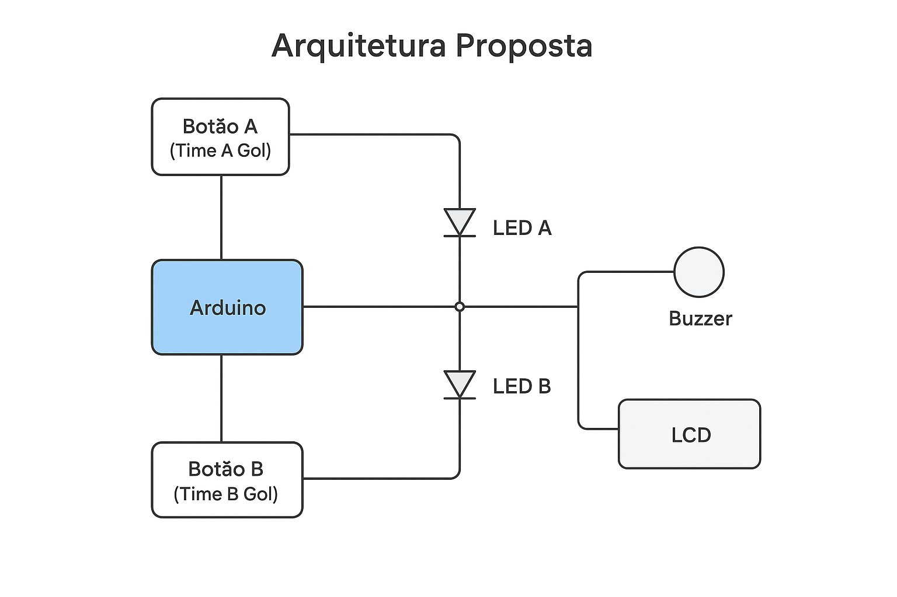

# Projeto IoT: Placar de Jogo - Canal Passa a Bola ⚽

## Integrantes
| RM      | Nome Completo          |
|---------|----------------------|
| 562142  | Luiz Antonio Morais   |
| 561997  | Nicolas Barnabe      |
| 561459  | Kevin Venancio       |
| 561568  | Guilherme Moura      |

---

## Descrição do Projeto
O **Placar de Jogo IoT** é um sistema eletrônico desenvolvido para monitorar e exibir gols de partidas de futebol em tempo real. O projeto foi idealizado para o canal **"Passa a Bola"** com o objetivo de mostrar como **IoT (Internet das Coisas)** pode ser aplicada em esportes, proporcionando interatividade e uma experiência visual para jogadores e espectadores.  

O projeto simula um **sensor de gol** utilizando **botões físicos**, que ao serem pressionados, atualizam o placar, acendem um LED correspondente e emitem um som de buzzer para sinalizar a pontuação. O placar é exibido em um **LCD 16x2 com interface I2C**, tornando a visualização clara e imediata.

---

## Arquitetura Proposta

### Diagrama do Sistema


### Explicação dos Componentes
1. **Botões físicos (IoT devices)**: Simulam os sensores de gol para cada time. Cada vez que um botão é pressionado, envia um sinal digital ao Arduino.  
2. **Arduino Uno (Backend)**: Processa os sinais dos botões, atualiza o LCD, aciona LEDs e toca o buzzer.  
3. **LEDs (Frontend visual)**: Pisca rapidamente quando um gol é marcado, oferecendo feedback visual instantâneo.  
4. **Buzzer (Frontend sonoro)**: Emite som curto para indicar a pontuação, reforçando a sinalização do gol.  
5. **LCD 16x2 I2C (Frontend visual)**: Exibe o placar atualizado em tempo real para ambos os times.

Essa arquitetura permite **interatividade em tempo real**, resposta imediata a eventos e visualização clara do placar, mantendo baixo custo e simplicidade de implementação.

---

## Recursos Necessários

### Hardware
- 1 Arduino Uno  
- 1 LCD I2C 16x2  
- 2 Botões físicos (simulando sensores de gol)  
- 2 LEDs (um para cada time)  
- 1 Buzzer  
- Jumpers e resistores  

### Software
- Arduino IDE  
- Biblioteca **LiquidCrystal_I2C**  

### Plataformas de Simulação
- **Wokwi Arduino Simulator** ([Clique aqui para simulação](https://wokwi.com/projects/442301501864629249))  

---

## Instruções de Uso

1. Conecte o Arduino aos componentes conforme o diagrama.  
2. Certifique-se de que os botões estão funcionando como **sensores de gol**.  
3. Ligue o Arduino ao computador ou fonte de energia.  
4. Abra o código no Arduino IDE e faça o upload.  
5. Ao iniciar, o LCD exibirá **“Placar de Jogo”** por 2 segundos.  
6. Para marcar um gol, pressione o botão correspondente ao time:  
   - O LED piscará.  
   - O buzzer emitirá um som curto.  
   - O LCD será atualizado com o novo placar.  
7. Para teste sem hardware, utilize o **Wokwi Simulator** configurando os componentes virtuais.

### Dicas e Comandos Úteis
- Certifique-se de que os botões estão em **INPUT_PULLUP** para evitar leituras falsas.  
- Ajuste o `debounceDelay` se os botões registrarem múltiplos sinais por um clique.  
- Com **Arduino CLI**:
```bash
arduino-cli lib update-index
arduino-cli lib install "LiquidCrystal_I2C"
arduino-cli compile --fqbn arduino:avr:uno PlacarDeJogo.ino
arduino-cli upload -p /dev/ttyUSB0 --fqbn arduino:avr:uno PlacarDeJogo.ino


#include <Wire.h>
#include <LiquidCrystal_I2C.h>

// Inicializa o LCD 
LiquidCrystal_I2C lcd(0x27, 16, 2);

// Botões simulando sensores de gol
const int botaoTimeA = 7;
const int botaoTimeB = 8;

// LEDs para sinalizar gol
const int ledTimeA = 9;
const int ledTimeB = 10;

// Buzzer
const int buzzer = 6;

// Contadores de gols
int golsTimeA = 0;
int golsTimeB = 0;

// Debounce
unsigned long ultimoTempoA = 0;
unsigned long ultimoTempoB = 0;
const unsigned long debounceDelay = 200; 

void setup() {
  pinMode(botaoTimeA, INPUT_PULLUP);
  pinMode(botaoTimeB, INPUT_PULLUP);
  pinMode(ledTimeA, OUTPUT);
  pinMode(ledTimeB, OUTPUT);
  pinMode(buzzer, OUTPUT);
  lcd.begin(16, 2);
  lcd.backlight();
  lcd.setCursor(0, 0);
  lcd.print("Placar de Jogo");
  delay(2000);
  atualizarPlacar();
}

void loop() {
  unsigned long tempoAtual = millis();
  
  if(digitalRead(botaoTimeA) == LOW && tempoAtual - ultimoTempoA > debounceDelay){
    golsTimeA++;
    piscarLed(ledTimeA);
    tocarBuzzer();
    atualizarPlacar();
    ultimoTempoA = tempoAtual;
  }
  
  if(digitalRead(botaoTimeB) == LOW && tempoAtual - ultimoTempoB > debounceDelay){
    golsTimeB++;
    piscarLed(ledTimeB);
    tocarBuzzer();
    atualizarPlacar();
    ultimoTempoB = tempoAtual;
  }
}

void atualizarPlacar(){
  lcd.clear();
  lcd.setCursor(0, 0);
  lcd.print("Time A: ");
  lcd.print(golsTimeA);
  lcd.setCursor(0, 1);
  lcd.print("Time B: ");
  lcd.print(golsTimeB);
}

void piscarLed(int led){
  digitalWrite(led, HIGH);
  delay(200);
  digitalWrite(led, LOW);
}

void tocarBuzzer(){
  tone(buzzer, 1000, 200); 
}
